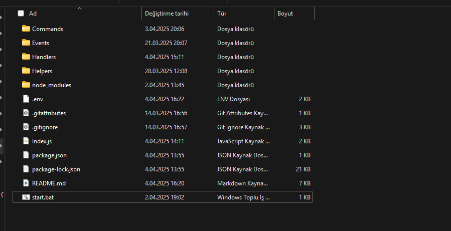
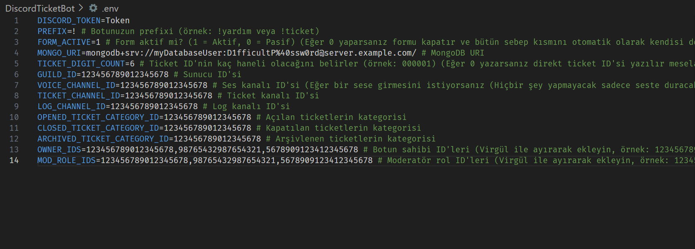
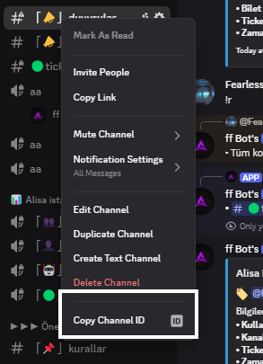
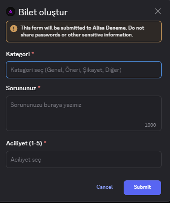
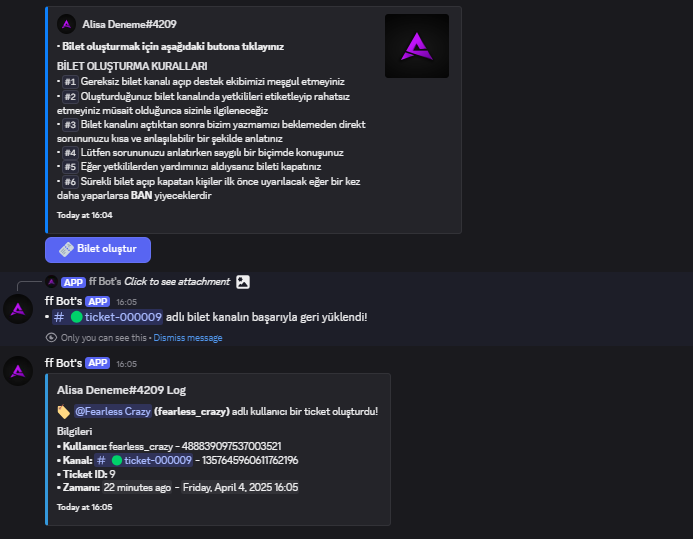
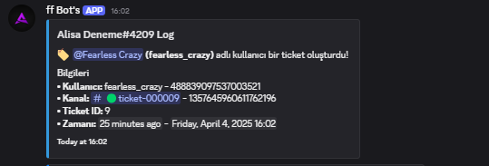

# 🎟️ Discord Ticket Bot - Gelişmiş Sistem

Merhaba! Bu proje, Discord sunucunuzda profesyonel ve form tabanlı bir destek sistemi kurmak isteyenler için geliştirildi. İster bireysel destek, ister topluluk yönetimi için kullanın; bu sistem size zamandan kazandırır ve kullanıcı deneyimini artırır.

> Bu bot, butonlara tıklayarak modal (form) üzerinden kullanıcıların kategori, aciliyet ve sebep seçerek ticket oluşturmasını sağlar. Yetkililer bu ticketlara müdahale edebilir, kullanıcı ekleyebilir, çağırabilir, arşivleyebilir veya kalıcı olarak kapatabilir.

---

## 🚀 Özellikler

- 🎛 **Form tabanlı ticket oluşturma** (Kategori, Aciliyet, Sebep bilgileriyle)
- 🔐 **Ticket yönetimi:** Kapatma, Arşivleme, Kalıcı kapatma, Çağırma, Kullanıcı ekleme gibi yetkili işlemleri
- 🧐 **Prefix ve Slash komut desteği** (Merkezi kontrol sistemiyle entegre)
- 📂 **MongoDB veritabanı** (Atlas üzerinde çalışacak şekilde optimize)
- 🗞️ **Loglama sistemi:** Tüm işlemler detaylı embed mesajlarla loglanır
- 👥 **Yetkilendirme:** Owner ve Mod rollerine özel yetkiler
- ✨ **Modüler sistem:** Butonlar, modallar ve komutlar birbirinden bağımsız olarak çalışabilir

---

## 📂 Kurulum Aşamaları

### 1. Klasörü İndir / Klonla

```bash
git clone https://github.com/pordarman/ultimate-ticket-bot.git
cd ultimate-ticket-bot
```

### 2. Gerekli Paketleri Yükle

```bash
npm install
```



---

### 3. `.env` Dosyasını Hazırla

Aşağıda örnek bir `.env` yapısı verilmiştir. Değişkenlerin ne anlama geldiği her satırın altında yorum olarak belirtilmiştir.

```env
DISCORD_TOKEN= # Botunuzun tokeni
PREFIX=! # Prefix
FORM_ACTIVE=1 # 1: Aktif, 0: Pasif
MONGO_URI= # MongoDB Atlas URI
TICKET_DIGIT_COUNT=6 # Ticket ID basamak sayısı

VOICE_CHANNEL_ID= # Ses kanalı ID
TICKET_CHANNEL_ID= # Ticket mesaj kanalı ID
LOG_CHANNEL_ID= # Log kanalı ID

OPENED_TICKET_CATEGORY_ID= # Açık ticket kategorisi
CLOSED_TICKET_CATEGORY_ID= # Kapalı ticket kategorisi
ARCHIVED_TICKET_CATEGORY_ID= # Arşiv ticket kategorisi

OWNER_IDS= # Bot sahibi ID'leri
MOD_ROLE_IDS= # Yetkili rol ID'leri
```

> 📃 `.env.example` dosyasını kopyalayarak kullanabilirsiniz.



---

## 🛂 MongoDB Atlas Kurulumu

1. https://www.mongodb.com/cloud/atlas
2. Yeni hesap oluşturun, Cluster kurun
3. Database Access üzerinden bir kullanıcı oluşturun
4. IP Whitelist: `0.0.0.0/0`
5. "Connect > Connection String Only" seçin
6. URI'yi `.env` dosyasına yapıştırın

---

## 👤 Discord ID'leri Nasıl Kopyalanır?

1. Discord Ayarlar > Gelişmiş > Geliştirici Modu > Aç
2. İlgili kullanıcı/rol/kanala sağ tık > "ID'yi Kopyala"



---

## ⚙️ Çalıştırma

### Windows
```bash
node index.js
```
veya
```bash
start.bat
```
> `start.bat`, terminal kullanmayan Windows kullanıcıları için kolaylık sağlar. Çift tıklamanız yeterlidir.

### Linux (PM2 ile)
```bash
npm i -g pm2
pm2 start index.js --name TicketBot
```
> ❌ Hata durumlarını görmek için:
```bash
pm2 logs TicketBot
```

> ✅ `.env` dosyası eksikse bot başlamaz, konsolda uyarı verir.

---

## 🔄 Güncelleme

```bash
pm2 restart TicketBot
```

---

## 📄 Komut Listesi

| Komut | Açıklama | Yetki |
|-------|----------|-------|
| `!ekle` | Eklenen kullanıcıya ticket kanalına erişim izni verir | Admin |
| `!arşivle` | Komut kullanılan kanalı arşivler | Admin |
| `!kapat` | Komut kullanılan kanalı kapatır | Admin |
| `!sil` | Komut kullanılan kanalı siler | Admin |
| `!çıkar` | Ticket kanalından bir kullanıcıyı çıkarır | Admin |
| `!çağır` | Ticket sahibini kanala çağırır | Admin |
| `!karaliste` | Kullanıcıyı karalisteye ekler veya çıkarır | Admin |
| `!yardım` | Yardım menüsünü gösterir | Admin |
| `!closetickets` | Kapalı ticketları listeler | Admin |
| `!opentickets` | Açık ticketları listeler | Admin |
| `!logs` | Ticket loglarını görüntüler | Admin |
| `!info` | Ticket bilgisini gösterir | Admin |
| `!userinfo` | Kullanıcının ticket bilgilerini gösterir | Admin |
| `!reload` | Komutları yeniden yükler | Sahip |
| `!button` | Ticket mesajını gönderir | Sahip |

---

## 🔗 Bağlantılar





---

## 📋 Lisans

- Kod MIT lisanslıdır. Satış için kullanabilirsiniz.
- Adını değiştirerek yayınlayabilirsiniz.
- Bot adı size aittir.

---

## 📞 Destek

- Gmail: ali.taha.celik@gmail.com
- Discord: fearless_crazy

---

## 🌟 Final Notu

Bu bot ile Discord sunucunuzdaki destek sistemini profesyonel bir hale getirebilirsiniz.

> Kod yapısı açık, geliştirilebilir ve modülerdir. Artık kontrol sizde! ✨
github: [ultimate-ticket-bot](https://github.com/pordarman/ultimate-ticket-bot)


