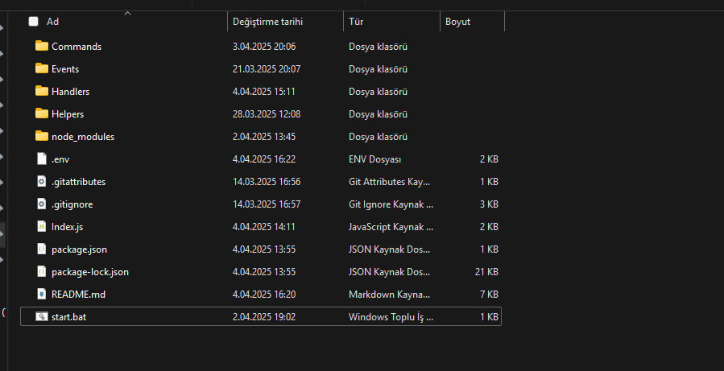
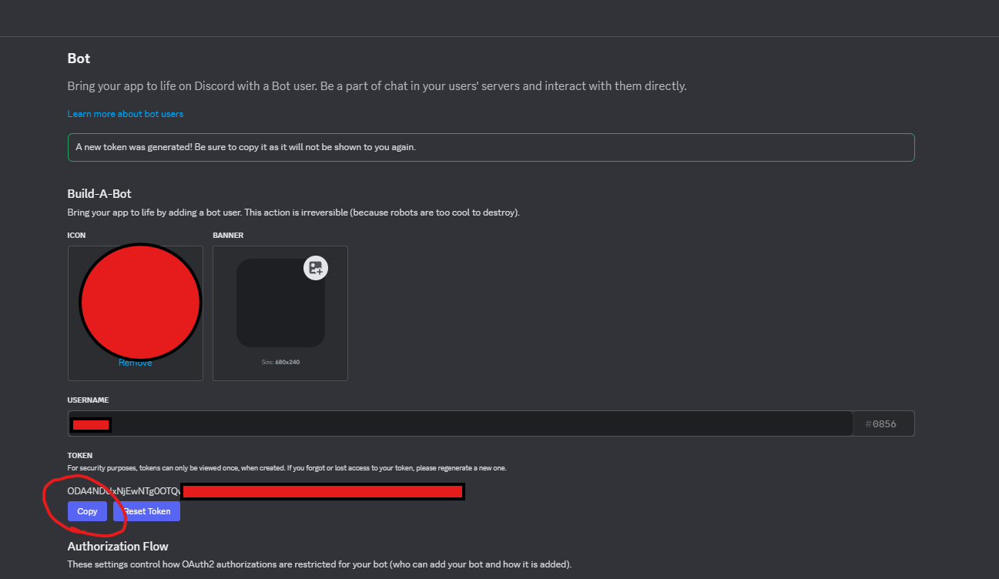
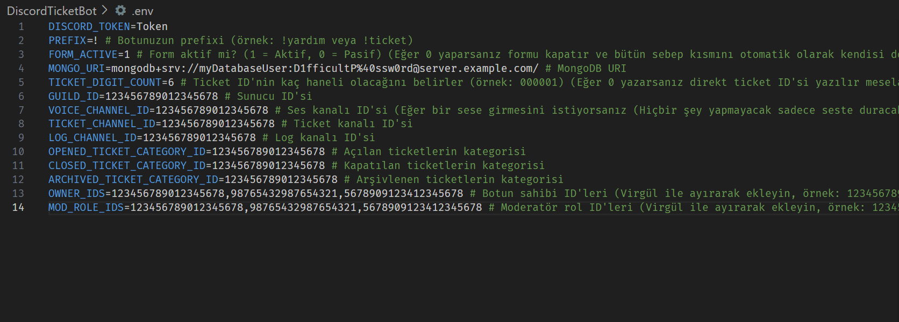
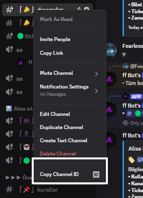
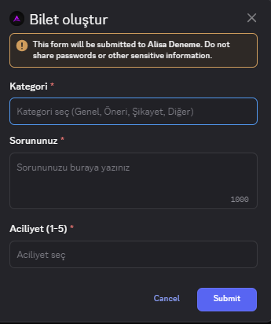
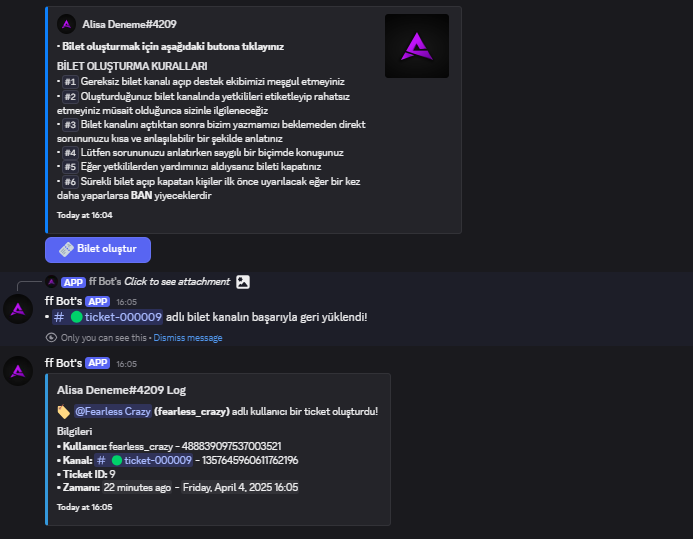
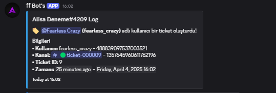

# 🎟️ Discord Ticket Bot - Gelişmiş Sistem

Merhaba! Bu proje, Discord sunucunuzda profesyonel ve form tabanlı bir destek sistemi kurmak isteyenler için geliştirildi. İster bireysel destek, ister topluluk yönetimi için kullanın; bu sistem size zamandan kazandırır ve kullanıcı deneyimini artırır.

> Bu bot, butonlara tıklayarak modal (form) üzerinden kullanıcıların kategori, aciliyet ve sebep seçerek ticket oluşturmasını sağlar. Yetkililer bu ticketlara müdahale edebilir, kullanıcı ekleyebilir, çağırabilir, arşivleyebilir veya kalıcı olarak kapatabilir.

---

## 🚀 Özellikler

- 🎫 **Form tabanlı ticket oluşturma** (Kategori, Aciliyet, Sebep bilgileriyle)
- 🔒 **Ticket yönetimi:** Kapatma, Arşivleme, Kalıcı kapatma, Çağırma, Kullanıcı ekleme gibi yetkili işlemleri
- 🧠 **Prefix ve Slash komut desteği** (Merkezi kontrol sistemiyle entegre)
- 💾 **MongoDB veritabanı** (Atlas üzerinde çalışacak şekilde optimize)
- 🧾 **Loglama sistemi:** Tüm işlemler detaylı embed mesajlarla loglanır
- 👥 **Yetkilendirme:** Owner ve Mod rollerine özel yetkiler
- ✨ **Modüler sistem:** Butonlar, modallar ve komutlar birbirinden bağımsız olarak çalışabilir

---

## 📂 Kurulum Aşamaları

### 1. Klasörü İndir / Klonla

```bash
git clone https://github.com/pordarman/ultimate-ticket-bot.git
cd ultimate-ticket-bot
```

### 2. Gerekli Paketleri Yükle

```bash
npm install
```



---

### 3. `.env` Dosyasını Hazırla

Aşağıda örnek bir `.env` yapısı verilmiştir. Değişkenlerin ne anlama geldiği her satırın altında yorum olarak belirtilmiştir.

```env
DISCORD_TOKEN= # Botunuzun tokeni (https://discord.com/developers üzerinden alınır)
PREFIX=! # Botunuzun prefixi (örnek: !yardım veya !ticket)
FORM_ACTIVE=1 # Form aktif mi? (1 = Aktif, 0 = Pasif) (Eğer 0 yaparsanız formu kapatır ve bütün sebep kısmını otomatik olarak kendisi doldurur)
MONGO_URI= # MongoDB Atlas URI bağlantısı (aşağıda anlatıldı)
TICKET_DIGIT_COUNT=6 # Ticket ID'nin kaç haneli olacağını belirler (örnek: 000001) (Eğer 0 yazarsanız direkt ticket ID'si yazılır mesela: 1)

GUILD_ID= # Sunucu ID'si
VOICE_CHANNEL_ID= # Ses kanalı ID'si (Eğer bir sese girmesini istiyorsanız bu kısmı doldurun)
TICKET_CHANNEL_ID= # Ticket oluşturma kanalının ID'si
LOG_CHANNEL_ID= # Ticket loglarının gönderileceği kanalın ID'si

OPENED_TICKET_CATEGORY_ID= # Yeni açılan ticketlar bu kategoriye taşınır
CLOSED_TICKET_CATEGORY_ID= # Kapatılan ticketlar bu kategoriye taşınır
ARCHIVED_TICKET_CATEGORY_ID= # Arşivlenen ticketlar bu kategoriye taşınır

OWNER_IDS= # Bot sahibi ID'leri (Virgül ile ayırın, boşluk bırakmayın)
MOD_ROLE_IDS= # Mod rol ID'leri (Virgül ile ayırın, boşluk bırakmayın)
```




---

### ❓ Discord ID'leri Nasıl Alınır?

1. Discord > Ayarlar > Gelişmiş > **Geliştirici Modu** → Aç
2. Sağ tıklamak istediğiniz kullanıcı, kanal veya rol → **ID'yi Kopyala**



---

## ☁️ MongoDB Atlas Kurulumu

Bu sistemde sadece **MongoDB Atlas (bulut)** kullanılacaktır.

1. [https://www.mongodb.com/cloud/atlas](https://www.mongodb.com/cloud/atlas) sitesine gidin
2. Ücretsiz hesap oluşturun ve bir "Cluster" oluşturun
3. **Database Access** kısmından bir kullanıcı oluşturun
4. IP Whitelist olarak `0.0.0.0/0` girin (her yerden erişim için)
5. **Connect > Connect your application > Connection String Only** seçeneğinden URI alın
6. Aldığınız URI’yi `.env` dosyasındaki `MONGO_URI` kısmına yapıştırın

> 🎥 **YouTube Desteği:** "mongodb atlas connection string" şeklinde aratarak birçok Türkçe veya İngilizce anlatım videosuna ulaşabilirsiniz.

---

## 🧱 MongoDB Koleksiyonları

Sistem ilk başlatıldığında otomatik olarak şu koleksiyonlar oluşturulur:

- `Users` → Ticket açan kullanıcıların bilgileri
- `Tickets` → Ticket kanallarına ait bilgiler
- `Logs` → Ticket geçmişi, loglar ve zaman damgaları
- `Counters` → Ticket numaralandırmasını kontrol eden sayaç

> ⚠️ Elle koleksiyon oluşturmanıza gerek yoktur. Bot otomatik olarak oluşturacaktır.

---

## ⚙️ Çalıştırma

### Windows için
```bash
node index.js
```
veya
```bash
start.bat
```

### Linux için (PM2 ile)
```bash
npm i -g pm2
pm2 start index.js --name TicketBot
```

> ✅ Eğer `.env` dosyasındaki zorunlu alanlar eksikse bot başlamaz. Konsolda detaylı uyarı verilir.

---

## 🔁 Güncelleme Nasıl Yapılır?

1. Güncel kodları kaydedin ve daha sonradan açtığınız PowerShell ekranını kapatın ve tekrardan çalıştırın

2. PM2 kullanıyorsanız dosyaları bota yükleyin ve botu tekrardan başlatın
```bash
pm2 restart TicketBot
```

---

## 📌 Ekstra Bilgiler

- Slash komutlar prefix komutları yönlendirmeli çalışır, fazladan kod yazmanıza gerek yoktur.
- Tüm işlemler `Helpers/` klasöründe merkezi şekilde yönetilir.
- Log sistemi detaylıdır, tüm işlemleri `LOG_CHANNEL_ID` kanalına düşürür.
- Tüm ticket işlemleri kullanıcı formuyla yapılır (kategori, aciliyet ve açıklama bilgileri dahil).


---

---


---

## 🧾 Lisans ve Kullanım

- Kodlar MIT lisanslıdır. Satış için özgürce kullanabilirsiniz.
- Kodları kendi isminizle paylaşabilirsiniz, sadece saygı çerçevesinde kullanılması beklenir.
- Botun ismini siz belirlersiniz. Bu sistem size sadece "altyapı" olarak sunulur.

---

## 📞 Destek

Eğer herhangi bir hata veya sorunuz olduğunda aşağıdaki yollardan benimle iletişime geçebilirsiniz:

- Gmail: ali.taha.celik@gmail.com
- Discord: fearless_crazy

---

## ✨ Kapanış

Son olarak bu sistemi kullanarak sunucunuzdaki destek sistemini bir üst seviyeye taşıyabilirsiniz. Kod yapısı açık, geliştirilebilir ve modülerdir.

> 🎉 Altyapı hazır, ismini sen seç! Adını ne koyarsan koy, bu bot senin kontrolünde 🎈

